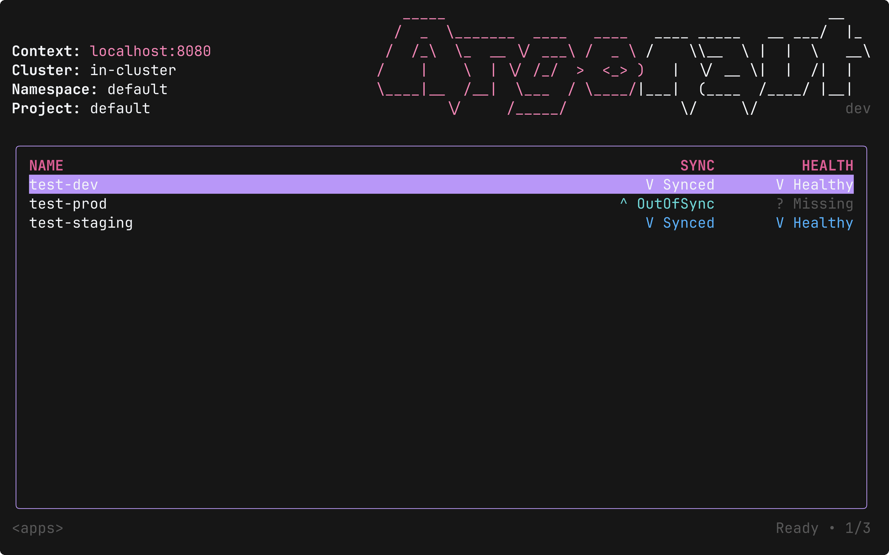
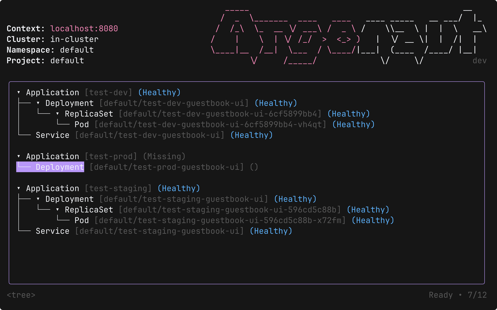
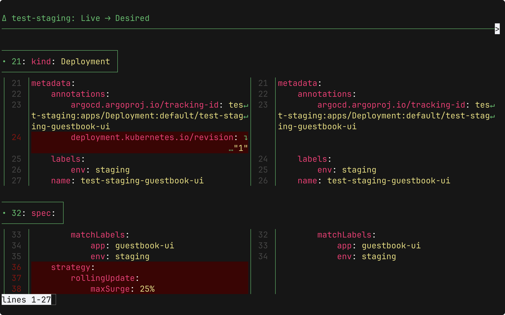
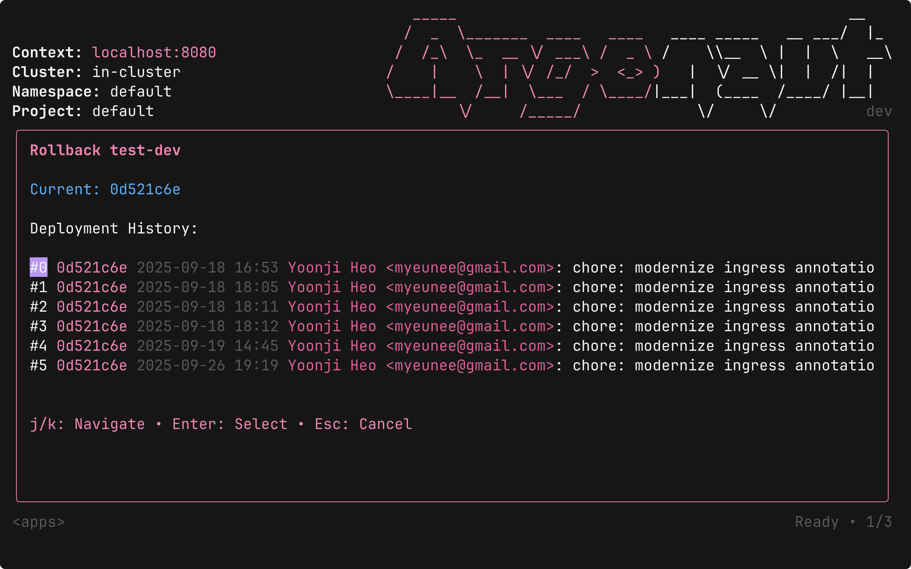

# 🐙 Argonaut — Argo CD TUI

Argonaut is a keyboard-first terminal UI for **Argo CD**, built with **React + Ink**. Browse apps, scope by clusters/namespaces/projects, stream live resource status, trigger syncs, inspect diffs in your favorite pager, and roll back safely — all without leaving your terminal.

> ❤️🐶
> Inspired by the great UX of [k9s](https://k9scli.io) — but for Argo CD.

---

## 📦 Prerequisites

- [**Argo CD CLI**](https://argo-cd.readthedocs.io/en/stable/cli_installation/) installed
- [**Delta**](https://dandavison.github.io/delta/installation.html) installed for enhanced diffs (optional, falls back to `git`)

---

## 🚀 Quick Start
```bash
# Install the Argonaut CLI globally
npm i --global argonaut-cli

# Log in to your Argo CD server
argocd login

# Start Argonaut
argonaut
```

---

## ✨ Highlights

- **Instant app browsing** with live updates (NDJSON streams)
- **Scoped navigation**: clusters → namespaces → projects → apps
- **Command palette** (`:`) for actions: `sync`, `diff`, `rollback`, `resources`, etc.
- **Live resources view** per app with health & sync status
- **External diff integration**: prefers `delta`, falls back to `git --no-index diff | less`
- **Guided rollback** with revision metadata and progress streaming
- **Keyboard-only workflow** with Vim-like navigation

---

## 📸 Screenshots

### **Apps**  


### **Resources**  


### **Diff**  


### **Rollback**  

