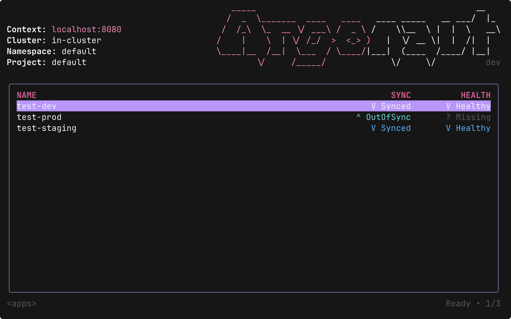

# 🐙 Argonaut — Argo CD TUI

[](https://github.com/darksworm/argonaut/releases/latest)
[](https://github.com/darksworm/argonaut/blob/main/LICENSE)
[](https://www.coderabbit.ai)

Argonaut is a keyboard-first terminal UI for **Argo CD**, built with **Bubbletea**. Browse apps, scope by clusters/namespaces/projects, stream live resource status, trigger syncs, inspect diffs in your favorite pager, and roll back safely — all without leaving your terminal.

> ❤️ 🐶
> &nbsp;Inspired by the great UX of [k9s](https://k9scli.io) — but for Argo CD.

---

## 📦 Prerequisites

- [**Argo CD CLI**](https://argo-cd.readthedocs.io/en/stable/cli_installation/) installed
- [**Delta**](https://dandavison.github.io/delta/installation.html) installed for enhanced diffs (optional, falls back to `git`)

---

## 🚀 Installation methods

<details>
  <summary><strong>Install Script (Linux/macOS)</strong></summary>

```bash
curl -sSL https://raw.githubusercontent.com/darksworm/argonaut/main/install.sh | sh
```

The install script automatically detects your system (including musl vs glibc on Linux) and downloads the appropriate binary from the latest release.

You can also install a specific version:
```bash
curl -sSL https://raw.githubusercontent.com/darksworm/argonaut/main/install.sh | sh -s -- v1.13.0
```
</details>

<details>
  <summary><strong>Homebrew (Linux/MacOS)</strong></summary>

```bash
brew tap darksworm/homebrew-tap
brew install darksworm/tap/argonaut
```
</details>

<details>
  <summary><strong>AUR (Arch User Repository)</strong></summary>

```bash
yay -S argonaut-bin
```
</details>

<details>
    <summary><strong>Nix</strong></summary>
With Nix and Flakes enabled, you can run or install Argonaut directly from the repository.

### Run Directly

To run Argonaut without permanently installing it, use the `nix run` command:

```bash
nix run github:darksworm/argonaut
```

### Development Shell

To enter a development shell with Argonaut and its dependencies (like Go, Delta, and Argocd) available for development, use the `nix develop` command:

```bash
nix develop github:darksworm/argonaut
```

### Flakes

If you are using Flakes to manage your systems add this to your Flake:

```nix
inputs = {
  argonaut = {
    url = "github:darksworm/argonaut";
    inputs.nixpkgs.follows = "nixpkgs";
  };
  # ...
}
```

</details>

<details>
  <summary><strong>Docker</strong></summary>

Pull the image:
```bash
docker pull ghcr.io/darksworm/argonaut:latest
```

Run with mounted Argo CD config (as your host user to preserve permissions):
```bash
docker run -it --rm \
  -u $(id -u):$(id -g) \
  -v ~/.config/argocd:/home/appuser/.config/argocd:ro \
  ghcr.io/darksworm/argonaut:latest
```

The container needs access to your Argo CD configuration for authentication. The `:ro` flag mounts it as read-only for security.
</details>

[//]: # (</details>)

[//]: # (<details>)

[//]: # (  <summary><strong>NUR &#40;Nix User Repository&#41;</strong></summary>)

[//]: # ()
[//]: # (```bash)

[//]: # (nix-env -iA nur.repos.darksworm.argonaut)

[//]: # (```)

[//]: # (</details>)

<details>
  <summary><strong>Download a binary</strong></summary>

You can download binaries and packages in from the [**latest release**](https://github.com/darksworm/argonaut/releases/latest).

</details>

## ⚡ Quickstart
```bash
# Log in to your Argo CD server
argocd login

# Start Argonaut
argonaut
```

---

## ✨ Highlights

- **Instant app browsing** with live updates (NDJSON streams)
- **Scoped navigation**: clusters → namespaces → projects → apps
- **Command palette** (`:`) for actions: `sync`, `diff`, `rollback`, `resources`, etc.
- **Live resources view** per app with health & sync status
- **External diff integration**: prefers `delta`, falls back to `git --no-index diff | less`
- **Guided rollback** with revision metadata and progress streaming
- **Keyboard-only workflow** with Vim-like navigation

---

## 📸 Screenshots

### **Live Apps**  


### **Sync**


### **Live Resources**


### **Diff**  


### **Rollback**  


### **Delete apps**  


### **Enjoy colorful themes**  


## Advanced Features

### Client certificate authentication
Argonaut supports client certificate authentication. You just need to pass a couple arguments to the argonaut command:

```bash
argonaut --client-cert=/path/to/cert --client-cert-key=/path/to/key
```

### Self-signed certificates
If your Argo CD server uses a self-signed certificate, you can provide a custom CA certificate to trust:

```bash
argonaut --ca-cert=/path/to/ca.crt
```

### Port-forward mode

If your Argo CD server isn't directly accessible (e.g., running in a private cluster), Argonaut can connect via kubectl port-forward:

```bash
# Configure ArgoCD CLI for port-forward mode
argocd login --port-forward --port-forward-namespace argocd

# Start Argonaut (automatically detects port-forward mode)
argonaut
```

**Requirements:**
- `kubectl` configured with access to the cluster
- ArgoCD server pod running in the target namespace

**Custom namespace:** If ArgoCD is installed in a different namespace, add to your config:
```toml
# ~/.config/argonaut/config.toml
[port_forward]
namespace = "my-argocd-namespace"
```

---

## ⚙️ Configuration

Argonaut stores its configuration in a TOML file at `~/.config/argonaut/config.toml` (or `$XDG_CONFIG_HOME/argonaut/config.toml`).

You can override the config path with the `ARGONAUT_CONFIG` environment variable.

### Example Configuration

```toml
[appearance]
theme = "tokyo-night"

[appearance.overrides]
# Override individual theme colors (hex format)
# accent = "#ff79c6"
# success = "#50fa7b"

[sort]
field = "name"      # name, sync, health
direction = "asc"   # asc, desc

[k9s]
command = "k9s"           # Path to k9s executable
context = ""              # Override Kubernetes context for k9s

[diff]
viewer = ""               # Interactive diff viewer (e.g., "code --diff {left} {right}", "meld {left} {right}")
formatter = ""            # Diff formatter command (e.g., "delta --side-by-side")

[http_timeouts]
request_timeout = "10s"   # Timeout for HTTP requests (increase for large deployments)
```

### Configuration Options

#### `[appearance]`

| Option | Description | Default |
|--------|-------------|---------|
| `theme` | Color theme name (see available themes below) | `tokyo-night` |

**Available themes:**
- **Dark themes**: `catppuccin-mocha`, `dracula`, `gruvbox-dark`, `monokai`, `nord`, `one-dark`, `oxocarbon`, `solarized-dark`, `tokyo-night`, `tokyo-storm`
- **Light themes**: `catppuccin-latte`, `gruvbox-light`, `one-light`, `onehalf-light`, `solarized-light`
- **Accessibility**: `colorblind-safe`, `grayscale-lowchroma`, `high-contrast`
- **Special**: `inherit-terminal` (uses your terminal's ANSI color palette)

You can also change the theme at runtime using the `:theme <name>` command.

#### `[appearance.overrides]`

Override individual theme colors with hex values. Available color keys:
- `accent`, `warning`, `dim`, `success`, `danger`, `progress`, `unknown`, `info`, `text`, `gray`
- `selected_bg`, `cursor_selected_bg`, `cursor_bg`, `border`, `muted_bg`, `shade_bg`, `dark_bg`

#### `[sort]`

| Option | Description | Default |
|--------|-------------|---------|
| `field` | Sort field (`name`, `sync`, `health`) | `name` |
| `direction` | Sort direction (`asc`, `desc`) | `asc` |

You can also change sorting at runtime using the `:sort <field> <direction>` command.

#### `[k9s]`

Integration settings for [k9s](https://k9scli.io), the Kubernetes TUI.

| Option | Description | Default |
|--------|-------------|---------|
| `command` | Path to k9s executable | `k9s` |
| `context` | Override Kubernetes context when launching k9s | (none) |

Press `K` on a resource in the tree view to open it in k9s.

#### `[diff]`

Settings for diff viewing and formatting.

| Option | Description | Default |
|--------|-------------|---------|
| `viewer` | Interactive diff viewer command. Use `{left}` and `{right}` as placeholders for file paths. | (none) |
| `formatter` | Non-interactive diff formatter piped through before display | (none, falls back to `delta` if installed) |

**Examples:**

```toml
[diff]
# Use VS Code as diff viewer
viewer = "code --diff {left} {right} --wait"

# Use meld as diff viewer
viewer = "meld {left} {right}"

# Use delta with custom options
formatter = "delta --side-by-side --line-numbers"
```

If no `viewer` is set, diffs are shown in an internal pager. If no `formatter` is set but [delta](https://dandavison.github.io/delta/) is installed, it will be used automatically.

#### `[http_timeouts]`

Settings for HTTP request timeouts. Useful for large deployments with thousands of applications where API responses take longer.

| Option | Description | Default |
|--------|-------------|---------|
| `request_timeout` | Timeout for all HTTP requests to ArgoCD API. Use Go duration format (e.g., "30s", "1m", "90s") | `"10s"` |

**Examples:**

```toml
[http_timeouts]
# For large deployments with thousands of applications
request_timeout = "60s"

# For very large deployments
request_timeout = "2m"
```

> **Note:** If you're experiencing timeout errors when listing applications or resources, increase this value. The timeout applies to all API operations including listing applications, getting resources, and sync operations.

#### `[port_forward]`

Settings for port-forward mode (when ArgoCD CLI is configured with `server: port-forward`).

| Option | Description | Default |
|--------|-------------|---------|
| `namespace` | Kubernetes namespace where ArgoCD is installed | `argocd` |

---

## 🤝 Contributing

See [CONTRIBUTING.md](CONTRIBUTING.md) for guidelines on how to contribute to this project.
